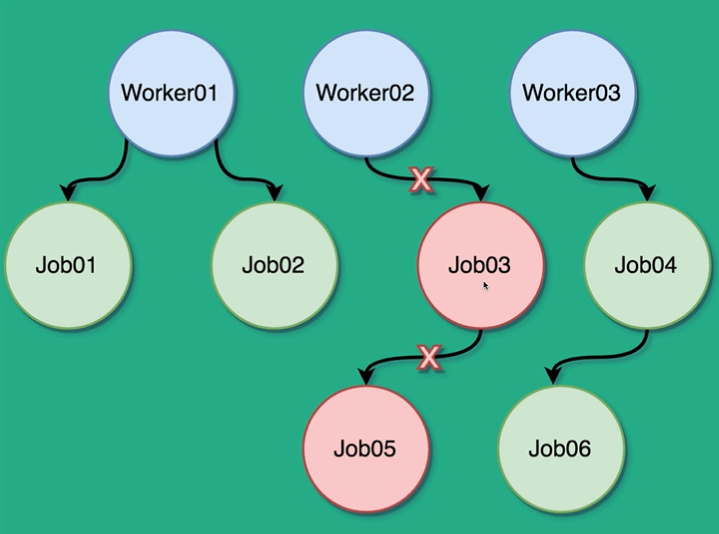

# 初探Context
时间：2021-02-21 


## Summary

> - [Go实现并发的手段](#Go实现并发的手段)   
> - [参考文章](#参考文章)

## Go实现并发的手段    

 - waitGroup：使用场景为一个 Job 需要拆分成多个 subjob 去跑，最后去所有 subjob 的执行结果汇总，详细参考 [waitGroup case](../../case_waitgroup_case)。waitGroup 实现中止程序的方法，可以使用如下 demo 
   ```go
    func main() {
    	stop := make(chan bool)
    	go func() {
    		for {
    			select {
    			case <-stop:
    				fmt.Println("go the stop      channel")
    				return
    			default:
    				fmt.Println("still working")
    				time.Sleep(1 * time.Second)
    			}
    		}
    	}()
    
    	time.Sleep(5 * time.Second)
    	fmt.Println("Stop the goroutine")
    	stop <- true
    	time.Sleep(5 * time.Second)
    }
    
    // operation result
    still working
    still working
    still working
    still working
    still working
    still working
    Stop the goroutine
    go the stop  channel
   ```

 - Context:如果上述过程中的 goroutine 存在多个，而且每个 Job 又存在多个 usbJob,如下所示。使用 Context 可以实现在其他模块上层 cancel 掉 Worker02 下面的 subjob:Job03 Job05 也会自动陆续 cancel 掉。     
     


## 参考文章  
 - [用 10 分鐘了解 Go 語言 context package 使用場景及介紹](https://www.bilibili.com/video/BV17K411H7iw?from=search&seid=1280316704870484518)

