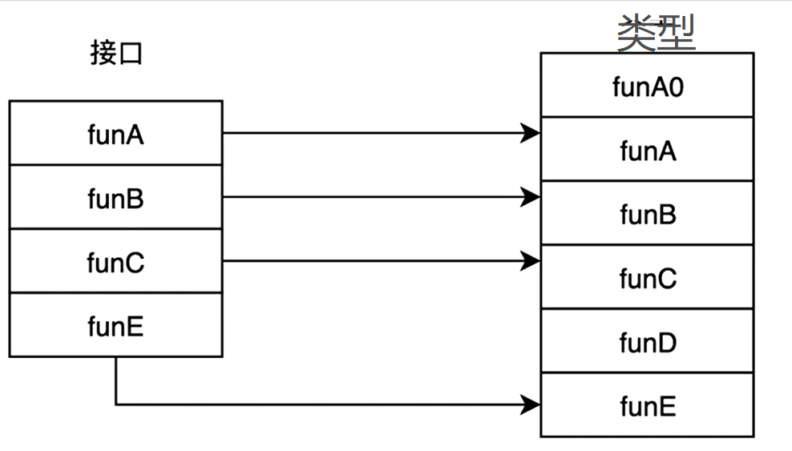

# go接口涵义与使用 
时间：2021-02-09   


## Summary  

> - [接口的概念与属性](#接口的概念与属性)   
> - [Go接口设计](#Go接口设计)   
>   - [GO实现业务逻辑解耦合CASE](#GO实现业务逻辑解耦合CASE)   
> - [Go接口的编译时与进行时](#Go接口的编译时与进行时)   
>   - [编译时](#编译时)   
>   - [进行时](#进行时)   
> - [GO接口组成](#GO接口组成)   
> - [GO内存逃逸](#GO内存逃逸)   

## 接口的概念与属性   

interface: 在面向对象编程语言过程中，接口是独立于两个类之间的类属性，允许对象之间进行信息交流的方式；  
character：    
  1. 隐藏细节   
  2. 控制系统复杂性   
  3. 权限控制   


## Go接口设计   

> 引用：不仅是小提琴塑造了小提琴手，我们也受到了自己使用工具的塑造。同样，编程语言也塑造了我们的编程习惯 --Edsger W.Dijikstra

Go 语言使用接口定义任意类型行为的边界，如传统向对象编程一样利用了接口的解耦合特性；同时取而代之，使用扁平化接口实现面向组合的设计模式加大了边界行。 

If instead the set of behaviors is fixed,such as in Go's statically defined interfaces,the uniformity of behavior enables data and progams to be composed uniformly,orthogonally,and safely.   --Rob Pile   


传统类继承编程方式的缺点：   
1. 需要尽早确立对象之间的结构    

go 正交式编程方式的优点：    
1. 接口方法可随意组合充当接口行为的边界    
  - go 语言可以为任何自定义类型添加方法     
  - 没有任何形式的基于类型的继承   
  - 隐式声明   


#### GO实现业务逻辑解耦合CASE   

基于 Xorm Module 的非接口式直接编程
```go
// XormDB's struction
type XormDB struct{
  db *Xorm.session
  ...
}

type Trade struct{
  *XormDB
  ...
}

func (t *Trade) InsertTrade(){
  t.db.Insert(t)
  ...
}
``` 

基于 Gorm Module 的非接口式直接编程
```go
// GormDB's struction
type GormDB struct{
  db *Gorm.session
  ...
}

type Trade struct{
  *GormDB
  ...
}

func (t *Trade) InsertTrade(){
  t.db.Create(t)
  ...
}
```

引入接口封装后解耦合带来的便利  

```go   


```


## Go接口的编译时与进行时


#### 编译时   

1. 屏蔽掉如 C++ 那样的 double type 模式出现的，未实现方法执行报错的问题   
2. 在编译时，对接口的类型进行排序，轮询接口的方法和类型的方法进行匹配，这是的时间复杂度是 O(m+n)  

#### 进行时   

1. 实现接口到类型的映射，   

   


## GO接口组成   


## GO内存逃逸


## Reference_blog   

 - [Go接口使用与实现](https://www.zhihu.com/zvideo/1292180581040553984)


